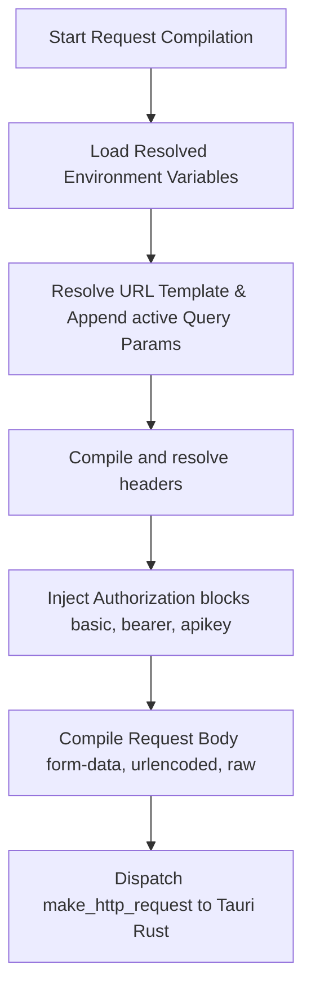

# Business Logic & Core Workflows

Kapivara's core business logic centers around preparing outgoing HTTP requests, resolving environment variables, handling authorization tokens, and persisting execution results. This document describes the step-by-step algorithms and engineering rules that power these workflows.

---

## 🔍 The Environment Variable Interpolation Engine

Kapivara uses a flexible template interpolation engine that scans text inputs for placeholder variables enclosed in double curly braces `{{ variableName }}`.

### 1. The Resolving Algorithm
The resolver utility located in `src/utils/environment-resolver.ts` provides two functions:

* **`resolveTemplateString(value, variables)`**:
  * Scans a string using a regular expression: `/{{\s*([A-Za-z0-9_.-]+)\s*}}/g`.
  * Allows whitespace padding inside the braces (e.g. `{{  api_token  }}` matches the key `"api_token"`).
  * If a variable key exists in the resolved map, it is replaced with its value. If it does not exist, it preserves the original template string to avoid destructive data loss.
* **`resolveVariablesInUnknown(input, variables)`**:
  * Traverses nested structures recursively. If it encounters a string, it resolves it. If it encounters an array, it maps over the elements. If it encounters an object, it recursively resolves all values across the keys.

---

## 🥞 Scope Merging & Key Precedence

Environment variables are defined in two scopes: **Global** and **Project**. When a request executes, the environment engine loads the active selections for both scopes and merges them using strict priority rules:

```
[ Active Global Environment Variables ] (Lower Priority)
                  │
                  ▼
[ Active Project Environment Variables ] (Higher Priority)
                  │
                  ▼
         [ Merged variables ]
```

1. **Active Global Environment**: Loaded and evaluated first. Variables that are enabled (`enabled === 1`) are written to the resolved variable map.
2. **Active Project Environment**: Loaded and evaluated second. Variables that are enabled (`enabled === 1`) are written to the resolved variable map.
3. **Precedence**: Because project variables are processed second, they overwrite duplicate keys defined in the global scope. This allows developers to set default endpoints globally and override them on specific project workspaces.

---

## ⚡ Request Compilation Pipeline

When a user clicks **Send Request**, Kapivara triggers a modular compilation pipeline inside `request.controller.ts` before forwarding the payload to the native Rust layer:



### Step 1: URL & Query Parameters compilation
* Resolves variables in the base URL string.
* Automatically inspects if the protocol is missing. If the resolved URL does not start with `http://` or `https://`, it defaults to prepending `https://`.
* Filters out inactive query parameters.
* Resolves variable templates inside parameter keys and values.
* Uses the browser's `URLSearchParams` object to serialize active query parameters, appending them securely to the URL string (detecting whether to append with `?` or `&`).

### Step 2: Headers compilation
* Filters active request headers.
* Resolves templates for both the header key and value.
* Inserts the resolved key-value pairs into a clean `Record<string, string>` map.

### Step 3: Authorization Processing
Depending on the configured `auth_type`, the compiler injects the necessary security payloads:
* **Bearer Token**:
  * Resolves variable templates in the token string.
  * Injects `Authorization: Bearer <resolved_token>` into the headers map.
* **Basic Auth**:
  * Resolves username and password variables.
  * Encodes the string `username:password` into base64 using the browser-native `btoa` function.
  * Injects `Authorization: Basic <base64_string>` into the headers map.
* **API Key**:
  * Resolves key and value templates.
  * If configured to `add_to == 'query'`, it appends the key and value as URL query parameters.
  * If configured to `add_to == 'header'`, it inserts the custom key-value pair directly into the headers map.

### Step 4: Body compilation
Payload compilation varies by `body_type`:
* **`json` / `raw`**:
  * Resolves variables directly inside the text payload.
* **`form-data`**:
  * Resolves variable templates inside both field keys and values.
  * Serializes the array back into a JSON string which is passed to Rust for file/text multi-part streaming.
* **`x-www-form-urlencoded`**:
  * Filters active rows, resolves variable templates for keys/values.
  * Compiles variables using `URLSearchParams` to create an urlencoded string payload.
  * Injects the explicit header: `Content-Type: application/x-www-form-urlencoded`.

---

## 💾 Response Logging & History Persistence

Once the native Rust HTTP client returns the response, Kapivara performs two updates:
1. **Zustand Console Log**: Appends a transient debug log item to `useConsoleStore` containing response metadata, headers, timestamp, and body. This populates the slide-up developer console at the bottom of the screen.
2. **Database Cache**: Updates the `response` field of the corresponding request inside the `requests` table in the SQLite database by stringifying the `RequestResponse` payload. This caches the last received response, ensuring it remains visible immediately when the user restarts the app or switches tabs.
