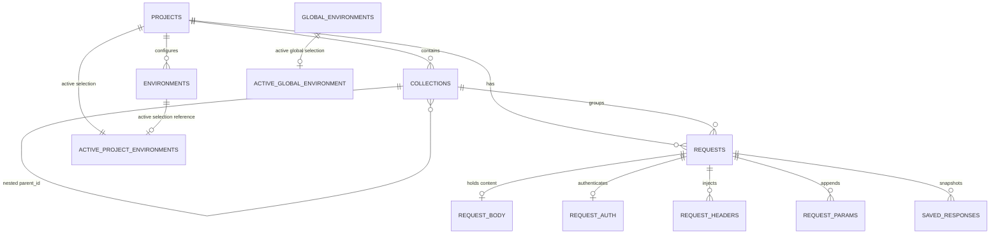

# SQLite Database Schema Design

Kapivara stores all workspace data locally within an embedded SQLite database named `kapivara.db`. The schema is modified and updated incrementally via a series of SQL migration scripts stored in the backend and loaded sequentially by `tauri-plugin-sql`.

This document details the database tables, fields, constraints, relationships, and migration history.

---

## 🏛️ Entity-Relationship Topology

Kapivara's schema centers around **Projects**. A project contains **Requests**, **Collections** (which are hierarchical folder nodes), and **Environments**.



---

## 📋 Comprehensive Database Schema & Tables

### 1. `projects`
Stores the high-level workspace containers.
```sql
CREATE TABLE IF NOT EXISTS projects (
  uid TEXT PRIMARY KEY,
  name TEXT NOT NULL,
  description TEXT,
  iconColor TEXT,
  lastOpenAt DATETIME,
  created_at DATETIME DEFAULT CURRENT_TIMESTAMP
);
```

### 2. `environments`
Stores project-scoped environmental configurations with their variables stored as a JSON array.
```sql
CREATE TABLE IF NOT EXISTS environments (
  id TEXT PRIMARY KEY,
  project_id TEXT NOT NULL,
  name TEXT NOT NULL,
  variables TEXT NOT NULL, -- JSON formatted array of variables
  created_at DATETIME DEFAULT CURRENT_TIMESTAMP,
  FOREIGN KEY(project_id) REFERENCES projects(uid) ON DELETE CASCADE
);
```

### 3. `collections`
Supports a hierarchical, folder-like directory nesting structure for requests.
```sql
CREATE TABLE IF NOT EXISTS collections (
  id TEXT PRIMARY KEY,
  project_id TEXT NOT NULL,
  parent_id TEXT, -- Self-referencing link for sub-folders
  name TEXT NOT NULL,
  created_at DATETIME DEFAULT CURRENT_TIMESTAMP,
  FOREIGN KEY(project_id) REFERENCES projects(uid) ON DELETE CASCADE,
  FOREIGN KEY(parent_id) REFERENCES collections(id) ON DELETE CASCADE
);
```

### 4. `requests`
Main request entity defining base connection options.
```sql
CREATE TABLE IF NOT EXISTS requests (
  id TEXT PRIMARY KEY,
  collection_id TEXT, -- Can be NULL if the request is in the root project directory
  project_id TEXT NOT NULL,
  name TEXT NOT NULL,
  method TEXT NOT NULL,
  url TEXT NOT NULL,
  response TEXT, -- JSON string representation of the latest HTTP response
  created_at DATETIME DEFAULT CURRENT_TIMESTAMP,
  FOREIGN KEY(collection_id) REFERENCES collections(id) ON DELETE SET NULL,
  FOREIGN KEY(project_id) REFERENCES projects(uid) ON DELETE CASCADE
);
```

### 5. `request_headers`
Represents Key-Value headers associated with a specific request.
```sql
CREATE TABLE IF NOT EXISTS request_headers (
  id TEXT PRIMARY KEY,
  request_id TEXT NOT NULL,
  key TEXT NOT NULL,
  value TEXT NOT NULL,
  is_active INTEGER DEFAULT 1, -- Boolean flag (0 = disabled, 1 = enabled)
  FOREIGN KEY(request_id) REFERENCES requests(id) ON DELETE CASCADE
);
```

### 6. `request_params`
Represents query parameters that are appended to the request URL.
```sql
CREATE TABLE IF NOT EXISTS request_params (
  id TEXT PRIMARY KEY,
  request_id TEXT NOT NULL,
  key TEXT NOT NULL,
  value TEXT NOT NULL,
  is_active INTEGER DEFAULT 1, -- Boolean flag
  description TEXT, -- Added in Migration v4
  FOREIGN KEY(request_id) REFERENCES requests(id) ON DELETE CASCADE
);
```

### 7. `request_body`
Holds request payload structure.
```sql
CREATE TABLE IF NOT EXISTS request_body (
  id TEXT PRIMARY KEY,
  request_id TEXT NOT NULL,
  body_type TEXT NOT NULL, -- 'none', 'json', 'form-data', 'x-www-form-urlencoded', 'raw'
  raw_data TEXT, -- Raw string body content or form array JSON
  FOREIGN KEY(request_id) REFERENCES requests(id) ON DELETE CASCADE
);
```

### 8. `request_auth`
Configures authentication presets for requests.
```sql
CREATE TABLE IF NOT EXISTS request_auth (
  id TEXT PRIMARY KEY,
  request_id TEXT NOT NULL,
  auth_type TEXT NOT NULL, -- 'none', 'bearer', 'basic', 'apikey'
  auth_data TEXT, -- JSON formatted configuration block (e.g. {token: '...'} or {username: '...'})
  FOREIGN KEY(request_id) REFERENCES requests(id) ON DELETE CASCADE
);
```

### 9. `settings`
Global application configurations, keyed by strings.
```sql
CREATE TABLE IF NOT EXISTS settings (
  key TEXT PRIMARY KEY,
  value TEXT NOT NULL,
  description TEXT,
  created_at DATETIME DEFAULT CURRENT_TIMESTAMP,
  updated_at DATETIME DEFAULT CURRENT_TIMESTAMP
);
```

### 10. `global_environments`
Independent environmental configurations shared globally across all projects.
```sql
CREATE TABLE IF NOT EXISTS global_environments (
  id TEXT PRIMARY KEY,
  name TEXT NOT NULL,
  variables TEXT NOT NULL, -- JSON formatted array
  created_at DATETIME DEFAULT CURRENT_TIMESTAMP
);
```

### 11. `active_project_environments`
Keeps track of which environment is selected for a given project.
```sql
CREATE TABLE IF NOT EXISTS active_project_environments (
  project_id TEXT PRIMARY KEY,
  environment_id TEXT,
  FOREIGN KEY(project_id) REFERENCES projects(uid) ON DELETE CASCADE,
  FOREIGN KEY(environment_id) REFERENCES environments(id) ON DELETE SET NULL
);
```

### 12. `active_global_environment`
Keeps track of the active global environment. Uses a constraint to enforce exactly one row.
```sql
CREATE TABLE IF NOT EXISTS active_global_environment (
  id INTEGER PRIMARY KEY CHECK (id = 1),
  environment_id TEXT,
  FOREIGN KEY(environment_id) REFERENCES global_environments(id) ON DELETE SET NULL
);
```

### 13. `saved_responses`
Snapshots of executed responses for a request, letting users look back at historical response records.
```sql
CREATE TABLE IF NOT EXISTS saved_responses (
  id TEXT PRIMARY KEY,
  request_id TEXT NOT NULL,
  name TEXT NOT NULL,
  status INTEGER NOT NULL,
  status_text TEXT NOT NULL,
  headers TEXT NOT NULL, -- JSON string representation of key-values
  body TEXT,
  time_ms INTEGER NOT NULL,
  created_at DATETIME DEFAULT CURRENT_TIMESTAMP,
  FOREIGN KEY(request_id) REFERENCES requests(id) ON DELETE CASCADE
);
```

---

## 📈 Migration History (v1 to v7)

The database schema has evolved incrementally:

1. **`1_init.sql` (v1)**: Sets up the initial foundation by introducing the `projects` table.
2. **`2_core_tables.sql` (v2)**: Defines the primary structural blocks: `environments`, `collections` (folders), `requests`, `request_headers`, `request_params`, `request_body`, and `request_auth`.
3. **`3_settings_table.sql` (v3)**: Introduces the `settings` key-value table and populates defaults:
   * Theme (`auto`, `light`, `dark`)
   * Language (`en`)
   * Editor font size (`14`)
   * Word wrap (`true`)
   * SSL Verification (`true`)
   * Request Timeout (`30000` ms)
   * Follow Redirects (`true`)
   * Telemetry (`false`)
4. **`4_add_description_to_params.sql` (v4)**: Adds the `description` column to the `request_params` query parameters list.
5. **`5_add_response_to_requests.sql` (v5)**: Adds `response` TEXT to `requests` to cache the last-received response block.
6. **`6_global_environments_and_active_selection.sql` (v6)**: Implements global environments (`global_environments`), project environment linkage (`active_project_environments`), and global active tracking (`active_global_environment` with one-row constraint).
7. **`7_saved_responses.sql` (v7)**: Adds `saved_responses` to persist multi-response snapshots for historical reference.
